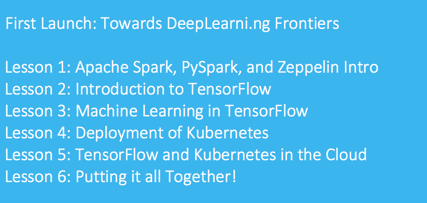
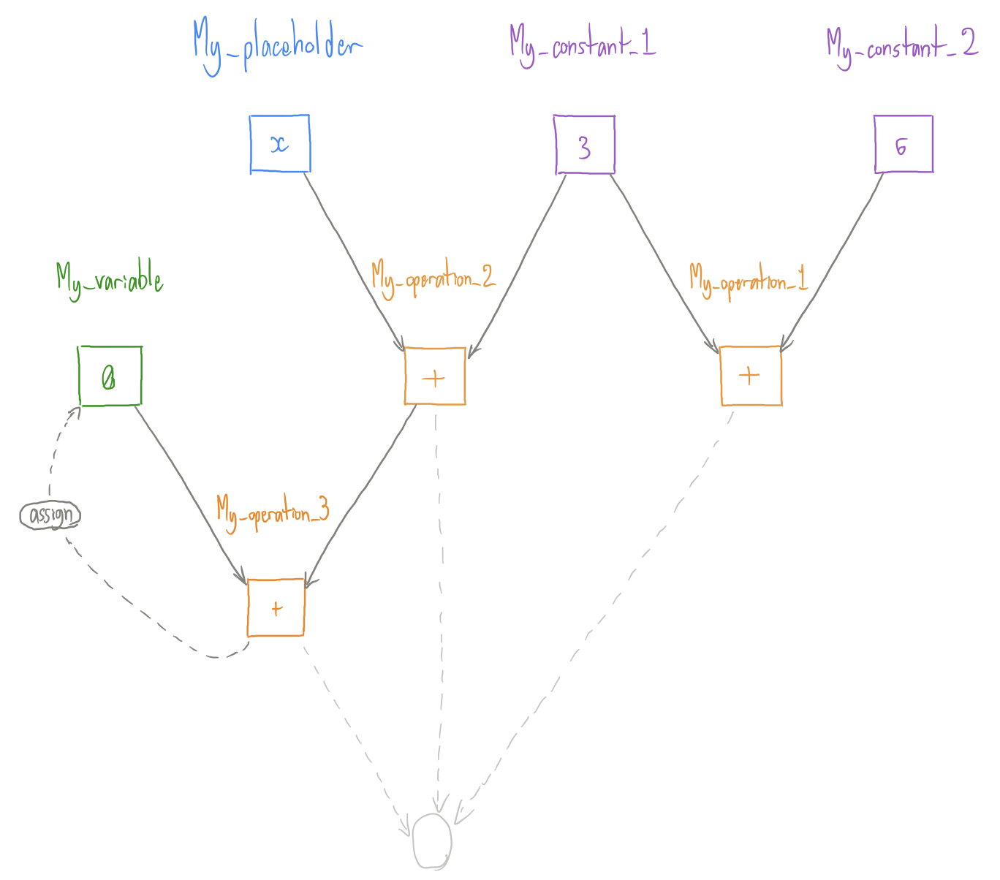

# Advanced Apache Spark, DeepLearni.ng and TensorFlow Lab

## Why This Meetup?
* We want to show members how to apply Spark and TensorFlow in a pragmatic manner to address industry use cases
* This first series of 4 lessons will combine the building blocks necessary to tackle these use cases



## Introduction:

Welcome to Lesson 2! Throughout this workshop we will try to give you a strong grasp on the basic concepts that make up TensorFlow. 

We will be using both Docker and Zeppelin to get things set up. We won’t go through these technologies again since they were talked about during the first lesson, but you can read up on both Docker and Zeppelin in our previous document.

This lesson and the following lesson were originally combined but we realized the content was too dense for one night. Because of this we have separated things in such a way that this lesson will cover the very basics of TensorFlow. We will cover some terminology, how to set up a graph, some important caveats to pay attention to, and a simple liner regression example. Next lesson will be a deep dive into how we can use these concepts for actual machine learning and deep learning.

### Requirements:
* Virtualbox (available from https://www.virtualbox.org/wiki/Downloads)
* Ubuntu 16.04 desktop iso (available at http://releases.ubuntu.com/16.04/ubuntu-16.04.4-desktop-amd64.iso)
* 30 gigabytes of free space (or more) for the virtual machine
* practical-learnings GitLab project (GitLab - Practical Learning)

### Note on preparing the Ubuntu virtual machine for this meetup
If you were not here for the previous session or need to rebuild your virtual machine, you can find instructions on how to do this using the documentation from Session1

### Docker:
Please refer to meetup prep documentation in order to find out how to set up your virtual machine and docker with the meetup image. The command we will be using to run docker is similar to the previous session, with some slight changes:

```bash
cd ~/practical-learnings/session2
git pull
docker run -it -p 8080:8080 -p 4040:4040 -p 6006:6006 -v `pwd`/notebook:/zeppelin/notebook -v `pwd`/data-sets:/data-sets --name zeppelin --rm epahomov/docker-zeppelin:zep_0.7_spark_2.1_hadoop_2.7
```

Note that the `--name` flag will be used later when installing tensorflow/running tensorboard

Remember that there will be a few warnings after hitting enter. We can ignore these.
Head to Firefox and make sure Zeppelin is running. Address will either be:

* localhost:8080

## Installing Tensorflow before we begin

The image we are using for the meetup doesn't come with Tensorflow, and thus must be installed. To do so we first run the following command to enter our docker container:

```bash
docker exec -it zeppelin /bin/bash
```

Then we run the following to install it:

```bash
python -m pip install tensorflow
```

Once this is complete, Tensorflow should be available for use within our notebooks.

## TensorFlow
For this lesson, the technology that everyone is talking about, TensorFlow!

TensorFlow is a computational framework that typically used for machine learning and deep learning. It can be used to do anything from simple computation to neural networks. TensorFlow even has its own visualization application, TensorBoard. We won’t touch on the wide variety of applications it can be used for but functionality includes: optimization, distributed systems, and pushing models to production.

We will cover some of the basic concepts before we go into the Zeppelin notebooks. The goal is to make sure you have at least heard some of the terms before attempting to use them.

In its most simplistic form, TensorFlow follows a data-flow paradigm. This is the concept of creating a graph, where each node is a mathematical computation, and letting data flow through it.

Data is held in a "Tensor", which can be thought of as an n-dimensional array (similar to a Numpy array if you have used them before).

So there we have it! Data (in _Tensors_) flowing through a predefined graph… _TensorFlow_!

A Tensor, mainly, has a name, a shape, and a type associated with it. If you don’t specify any of these, they will be inferred/generated for you. There are outliers that we will talk about as they come up.

Notice that I called it a predefined graph previously. This is a very important concept to how TensorFlow works. When you define a graph you are not actually running it! In fact, no data is available unless you are actually running the graph through a “session” (this includes constants!).

My two examples for understanding this concept are as follows:

1. A class in programming. You define the structure and logic of the class and then create an instance of the class to interact with it.
2. An RDD in Spark. You define the operations that will happen to the data and then run the operations through something like a `.collect()`.

For TensorFlow, you create the structure and logic of the graph and then create a session to run the graph.

This design time vs. run time is very important and you should understand it before we go forward. 

Finally, we will walk through the basics of a TensorFlow graph using the following diagram. This explanation will be high level, not actual code just yet.



This visual shows a basic graph that we will make in the notebook titled “2: Graphs and How to Use Them” (paragraph 9). It is designed to show a use case of four main concepts that make up a TensorFlow graph.

#### 1. Constant

Fairly straightforward. This is a constant value on the graph. You can define a constant that will be the same every time you run the graph. 

In the diagram, we define two constants `My_constant_1` and `My_constant_2`. We give them the values of 3 and 6 respectively. 


#### 2. Placeholder

Think of the graph as a function in regular programming. A placeholder would be an argument that the function requires. When defining the graph, you state that there will be a Tensor with a value but will not have access to it until run-time. You should definitely specify things like type and shape during design time!

We call our placeholder `My_placeholder`.

#### 3. Variable

This is not a variable in the classic programming sense, but a value that will vary across runs of the graph. You must designate the initial value of the variable. You then have access to the value during every run of the graph and can update it as a sort of "memory" from run to run.

We call our variable `My_variable`

#### 4. Operation

This is a mathematical operation that makes up the nodes of the graph. There are multiple ways to specify operations which we give an example of in the notebook titled 1: TensorFlow Basics (paragraphs 5 and 6).

We define three operations: 
- `My_operation_1` which adds `My_constant_1` and `My_constant_2`
- `My_operation_2` which adds `My_constant_1` and `My_placeholder`
- `My_operation_3` which adds the outcome of `My_operation_2` and `My_variable`. It then assigns the outcome back to `My_variable`.

With this new information, it is important to mention graph dependencies. If we run My_operation_1 we will simply get back the value of our two constants added together, which is 9. However, if we want to run `My_operation_2` or `My_operation_3` we can see that we require a value from `My_placeholder`. This means that we can run the first operation with no problems, but will have to give a value for our placeholder while running the other operations. 

TensorFlow handles dependencies without you having to do any extra work!


The last thing to talk about is a TensorFlow session. We have discussed the fact that building the graph is different that running the graph. The session is how we actually run things. We will see how we use it in the notebooks but we will mention the `feed_dict`. This is a dictionary that we pass to the `Session().run()`	 function that allows us to feed in values for our placeholders.

Note: TensorFlow seems scary, especially when you get to the later notebooks that touch on actual neural networks. Just try to remember that no matter what you do, TensorFlow works through a data flow graph. The later notebooks may look overwhelming but they are still graphs, they just do very interesting math at their nodes to allow for “learning”.
